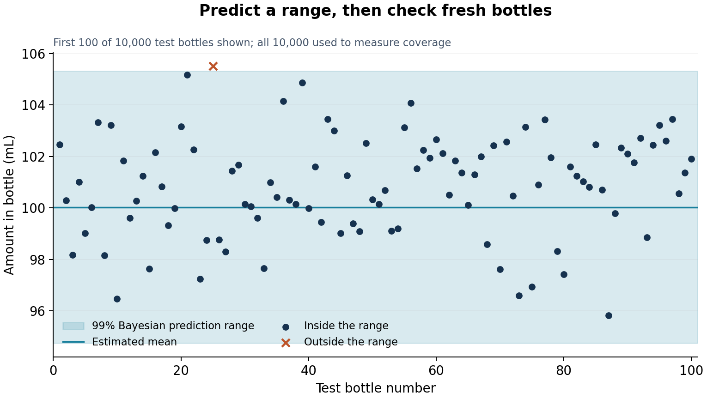

# A prediction range, then a check

**Bayes proposes a range. New measurements check how often it works.
Hoeffding puts a limit on the checking error.**

One example: a machine fills bottles. We learn from 20 bottles, predict a range
for the next bottle, and check that range on 10,000 new bottles.

[Read the short lesson](TUTORIAL.md) ·
[Run the notebook](Provable_UQ_Tutorial.ipynb)

## What the example says

1. The Bayesian model gives a **99% prediction range of about 94.75–105.31 mL**.
2. **9,909 of 10,000** fresh test bottles fall inside it: **99.09% measured coverage**.
3. Hoeffding subtracts **1.224 percentage points** to allow for sampling error.
4. The result: **with 95% confidence, the range covers at least 97.8% of bottles
   from the same process**. The reported lower bound is rounded down.

The model's 99% is a prediction under its assumptions. The validation result
is a separate statement supported by fresh measurements. It remains valid
even when the model's distributional assumptions are wrong, provided the test
bottles are independent and representative of the future process.



The example generates synthetic bottles so it runs anywhere. A claim about a
real machine requires fresh measurements from that machine.

## Run

Python 3.10 or newer:

```bash
git clone --branch provable-uq-tutorial --single-branch https://github.com/jatinbatra50/jatinbatra50.git
cd jatinbatra50
python -m pip install -r requirements-notebook.txt
jupyter lab Provable_UQ_Tutorial.ipynb
```

The notebook contains all its code. To regenerate the results without Jupyter:

```bash
python experiments.py
```

Four times as many test bottles halves the Hoeffding allowance:

```bash
python experiments.py --test-size 40000 --output-dir results/more-bottles
```

The main lesson is [TUTORIAL.md](TUTORIAL.md).
Reusable calculations are in [uq.py](uq.py), and saved numerical results are
in [report.json](results/demo/report.json).
[References and attribution](ATTRIBUTION.md).
