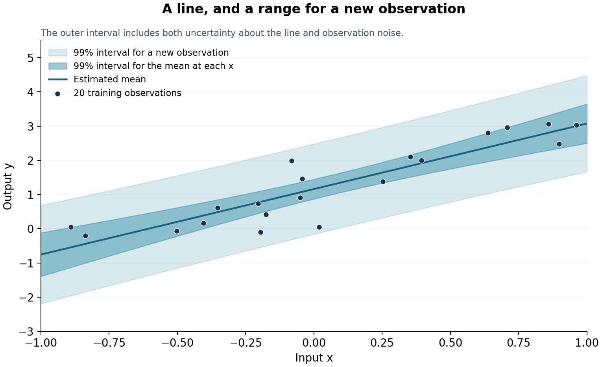

# Bayesian linear regression, then a coverage check

**Learn a line. Predict a range for a new observation. Check how often that
range works on fresh data.**

A short, runnable example of the Gaussian-prior, Gaussian-noise regression
model in Bishop's *Pattern Recognition and Machine Learning*, Section 3.3.

[Read the lesson](TUTORIAL.md) · [Run the notebook](Provable_UQ_Tutorial.ipynb)

## The example

A sensor has an input `x` and a noisy reading `y`. We learn its intercept and
slope from 20 observations. Each coefficient has a Gaussian prior; observation
noise is Gaussian with a fixed standard deviation of 0.5.

The posterior predictive interval includes both uncertainty about the line
and noise in a future reading.



## What the saved run says

- At **x = 0.5**, the predicted reading is **2.117**, with a **99% posterior
  predictive interval of about [0.777, 3.457]**.
- On **10,000 independent test pairs**, **9,902** readings fall inside their
  respective intervals: **99.02% measured coverage**.
- A one-sided Hoeffding bound gives **at least 97.7% coverage at 95%
  confidence**, with the reported minimum rounded down.

This validates overall coverage for new inputs sampled like the test inputs.
It does not certify a separate coverage rate at every possible input. The
Bayesian model's assumptions need not be correct for the coverage check;
the check needs independent, representative test pairs and a fixed predictor.

All data here are simulated so the example runs anywhere. A real application
needs fresh measurements from its actual process.

## Run

Python 3.10 or newer:

```bash
git clone --branch provable-uq-tutorial --single-branch https://github.com/jatinbatra50/jatinbatra50.git
cd jatinbatra50
python -m pip install -r requirements-notebook.txt
jupyter lab Provable_UQ_Tutorial.ipynb
```

The notebook contains all its code. To reproduce the saved results:

```bash
python experiments.py
```

Four times as many test pairs halves the Hoeffding allowance:

```bash
python experiments.py --test-size 40000 --output-dir results/more-measurements
```

Reusable calculations are in [uq.py](uq.py), and numerical results are in
[report.json](results/demo/report.json).
[References and attribution](ATTRIBUTION.md).
