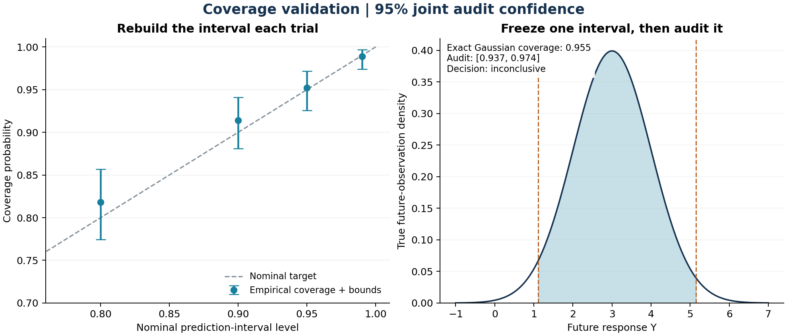
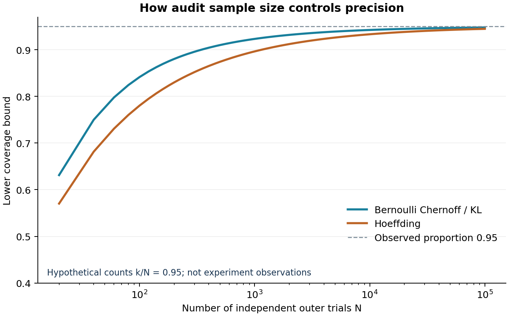

# Provable Validation of Uncertainty Quantification

**A self-contained mathematics and computer science tutorial: from a Monte
Carlo interval to a finite-sample coverage certificate.**

A program reports a “95% prediction interval.” You test it on 1,000 independent
examples and observe 953 successes. What has actually been established?

This repository answers that question with a fully specified experiment,
complete proofs, numerical algorithms, executable examples, and tests. It
starts from a small linear-regression simulation and develops tools that also
apply to independently audited machine-learning predictions and simulator
outputs.

> Coverage is the probability that a procedure succeeds. A coverage certificate
> quantifies how accurately an independent experiment has measured that
> probability. Constructing an interval and validating its coverage are two
> distinct statistical tasks.



## Read and run the standalone notebook

[**Open Provable_UQ_Tutorial.ipynb**](Provable_UQ_Tutorial.ipynb) contains the full
mathematics, worked solutions, embedded implementations, executed experiments,
and figures in one file. Download it and run it in Jupyter with NumPy and
Matplotlib installed. It does not import local repository modules, read data
files, or require network access while running.

To rebuild this notebook from the tutorial sources and execute its ordinary
Python cells from an empty working directory:

```bash
python scripts/build_tutorial_notebook.py
python scripts/execute_tutorial_notebook.py
```

## Start here

From the repository root, with Python 3.10 or later:

```bash
python -m pip install -r requirements.txt
python experiments.py --trials 1000 --mc-samples 1000 --seed 20260918 --output-dir results/demo
python -m unittest discover -s tests -v
```

The experiment writes `report.json`, `coverage.png`, and `sample-size.png`,
with SVG versions of both figures. The saved [example report](results/demo/report.json)
records the model, seed protocol, software versions, counts, confidence
budgets, and decisions. A quick installation check can instead use
`--trials 20 --mc-samples 30 --output-dir /tmp/uq-smoke`.

For the saved example environment, use Python 3.12 and
`python -m pip install -r requirements-reproduce.txt`. The report records
the exact versions; elapsed time and timestamps naturally vary between runs.

For the original executed notebook:

```bash
python -m pip install -r requirements-notebook.txt
jupyter lab uq1.ipynb
```

The notebook retains the original simulation loops. The command-line runner
vectorizes the regressions and shares randomness across the predeclared
levels; this preserves each level's experiment but produces a different
random stream. Their recorded counts need not coincide.

## The tutorial

Basic probability notation, elementary calculus, and Python are sufficient
for the main concentration proof. The linear-regression example additionally
uses sums, variances, and Gaussian random variables.

| Chapter | What you will be able to do |
|---|---|
| [1. Probability and targets](docs/01-probability-and-targets.md) | Distinguish mean uncertainty, future-response uncertainty, and uncertainty about coverage; specify precisely what is random. |
| [2. Concentration and certification](docs/02-concentration-and-certification.md) | Derive Chernoff, KL inversion, Hoeffding, simultaneous guarantees, and sample-size/power calculations. |
| [3. From theorem to code](docs/03-from-theorem-to-code.md) | Implement a stable certificate, design an independent audit, understand memory/runtime, and reproduce experiments. |
| [4. Extensions and limits](docs/04-extensions-and-limits.md) | Handle dependent pixels, select among fixed candidates, inspect results repeatedly, and distinguish simulator accuracy from statistical precision. |
| [5. Exercises and solutions](docs/05-exercises.md) | Work through counterexamples, derivations, interpretation questions, and small implementation projects. |

For a compact theorem statement, see [VALIDATION.md](VALIDATION.md). For the
first notebook audit and its recorded results, see
[the original validation report](docs/00-original-validation.md).

## The central guarantee

Fix $K$ interval procedures or configurations before inspecting the audit.
For configuration $k$, let $C_{k1},\ldots,C_{kN}$ be independent Bernoulli
coverage indicators with mean $p_k$, and let
$\widehat p_k=N^{-1}\sum_i C_{ki}$. Different configurations may share the
same validation data.

For $0<\delta<1$, define

$$
r=\sqrt{\frac{\log(2K/\delta)}{2N}}.
$$

Then Hoeffding and a union bound give

$$
\Pr\!\left\{
\text{for every }k,\quad
p_k\in[\max(0,\widehat p_k-r),\min(1,\widehat p_k+r)]
\right\}\ge1-\delta.
$$

The default implementation is sharper: invert the Bernoulli Chernoff bound,
using the interval of all $q\in[0,1]$ satisfying

$$
N\operatorname{kl}(\widehat p_k\Vert q)\le\log(2K/\delta),
\qquad
\operatorname{kl}(a\Vert q)=a\log\frac aq+(1-a)\log\frac{1-a}{1-q}.
$$

Chapter 2 proves every step, including the endpoint cases and why this
inversion is a confidence interval. These are classical results applied to a
precisely defined validation task; they are not presented as new concentration
theorems.

## A certificate in six lines

```python
from validation import coverage_certificate

report = coverage_certificate(
    953, 1000, delta=0.05, num_claims=4,
    method="kl", target_coverage=0.95,
)
print(report.to_dict())
```

The resulting coverage band is approximately **[0.9286, 0.9713]**. The result
is **inconclusive** for the minimum-coverage claim $p\ge0.95$.

| Verdict | Condition | Meaning on the confidence event |
|---|---|---|
| `certified` | Lower bound ≥ target | The minimum coverage requirement holds. |
| `below_target` | Upper bound < target | Coverage is below the requirement. |
| `inconclusive` | Neither condition | The audit has not established either conclusion. |

The module uses only the Python standard library. NumPy and Matplotlib are
needed for simulations and figures, not for computing certificates.

## The independent unit is the outer experiment

| Symbol | Role | What increasing it changes |
|---|---|---|
| $n$ | Observations in each synthetic training dataset | The fitted-prediction distribution |
| $R$ | Monte Carlo draws used to construct an interval | The interval-construction procedure |
| $N$ | Independent outer coverage trials | Precision of the coverage audit |
| $K$ | Predeclared claims | The simultaneous confidence correction |
| $\delta$ | Total audit failure budget | Confidence in the collection of bounds |

The audit sample size is $N$, not $NR$ and not the number of dependent pixels
in an image. Training/tuning, interval construction, and validation must be
separated in the manner required by the chosen target.



This second figure evaluates formulas at hypothetical counts with empirical
coverage fixed at 0.95. It is a precision comparison, not additional observed
data or a guarantee that a future audit will pass.

## What the executable example demonstrates

The original simulator constructs quantiles of **fitted mean plus fresh
noise**, while validation generates **true mean plus fresh noise**. Those
laws differ. The tutorial derives the difference and proves that the limiting
central construction interval overcovers in this Gaussian example. Finite
Monte Carlo construction still has random quantile error, so its actual
coverage is audited.

The new runner performs a four-level procedure audit and a separate audit of
one frozen interval. It splits the total failure budget between them, so the
whole report has a valid joint confidence statement. The frozen interval also
has an exact Gaussian coverage benchmark.

The [recorded default run](results/demo/report.json) is synthetic evidence
under the stated Gaussian model. It does not prove that a real-data model is
correct, certify every query location, or turn a nominal 95% interval into a
95% minimum-coverage guarantee.

## Repository map

| Path | Purpose |
|---|---|
| `validation.py` | Dependency-free Hoeffding and KL certificates; sample-size planning |
| `simulation.py` | Vectorized regression simulation and both audit targets |
| `experiments.py` | Reproducible command-line experiment and figure generation |
| `uq1.ipynb` | Original simulation, extended with executed finite-sample validation |
| `docs/` | Five tutorial chapters and the earlier validation report |
| `results/demo/` | Reproducible example report and PNG/SVG figures |
| `tests/` | Numerical, exact-binomial, simulator, CLI, and notebook integration tests |
| `.github/workflows/tests.yml` | Automated tests and a small experiment on Python 3.10 and 3.12 |

## Provenance and references

The starting simulation is [payal101/UQ_1](https://github.com/payal101/UQ_1).
See [ATTRIBUTION.md](ATTRIBUTION.md) for source provenance and the scope of the
new material. No license has been invented for the original code.

- W. Hoeffding (1963), [Probability Inequalities for Sums of Bounded Random Variables](https://doi.org/10.1080/01621459.1963.10500830).
- H. Chernoff (1952), [A Measure of Asymptotic Efficiency for Tests of a Hypothesis Based on the Sum of Observations](https://doi.org/10.1214/aoms/1177729330).

[Contributing](CONTRIBUTING.md) explains the proof and reproducibility standards
for changes. The extensions chapter identifies further projects without
claiming that this repository has solved new open problems.
